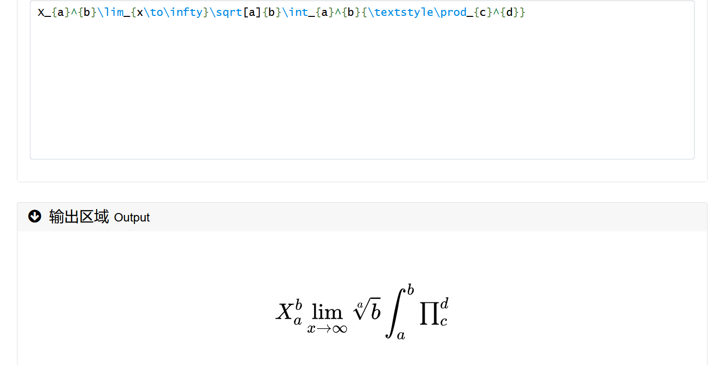
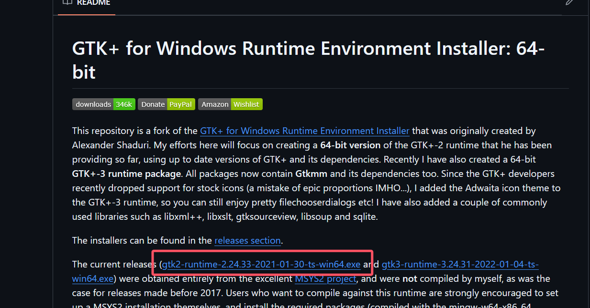

# Img2LatexDemo

```shell
git clone git@github.com:Lsnxiaoxiong/Img2LatexDemo.git
```


## 在线latex公式编辑器

[网址](https://www.latexlive.com/)

可用来查看latex公式渲染的结果




## Img2Latex

[官网](https://simpletex.net)

### 示例
示例代码在**api_img2latex**文件夹中，每一个文件夹代表一个模型示例。


## Latex2Img

[官网](https://github.com/uetchy/math-api)


### 示例

示例代码在**api_latex2img**文件夹中。

官网的api返回的结果是html数据，如果要将latex保存为图片，需要额外安装库。


### 环境准备

+ 安装[gtk2-runtime-2.24.33-2021-01-30-ts-win64.exe](https://github.com/tschoonj/GTK-for-Windows-Runtime-Environment-Installer/releases/download/2021-01-30/gtk2-runtime-2.24.33-2021-01-30-ts-win64.exe) [官网](https://github.com/tschoonj/GTK-for-Windows-Runtime-Environment-Installer)




+ 安装cairosvg库

```shell
pip install cairosvg
```

